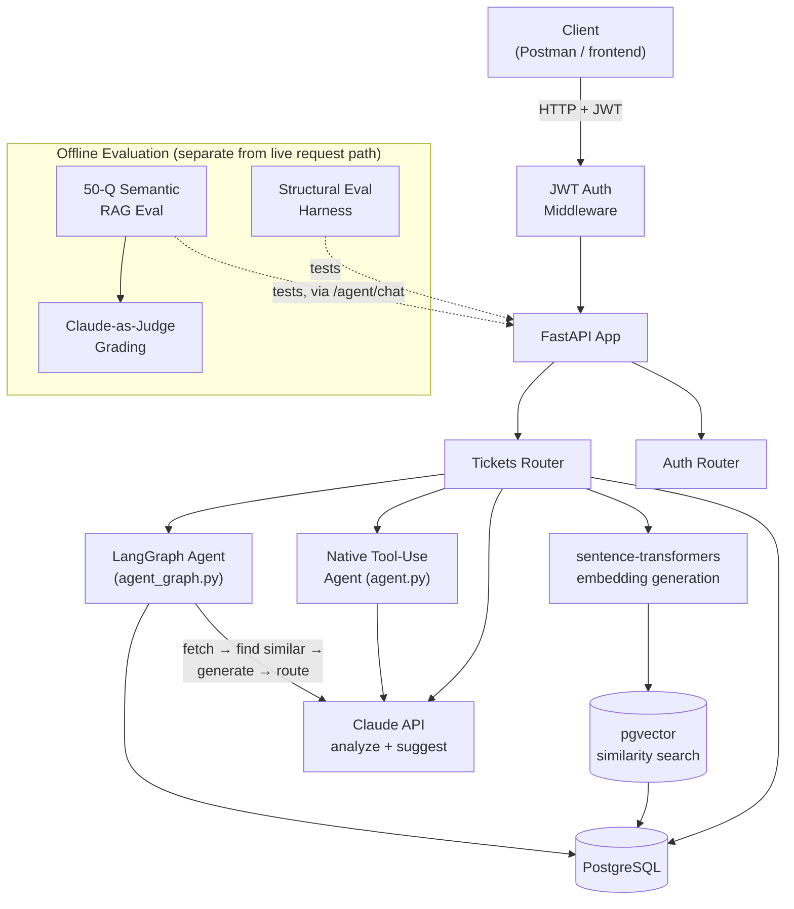

# Ticketing System — Architecture Diagram

*Last updated: 2026-09-17*

Reading the diagram top to bottom: a request enters through JWT auth, hits the FastAPI router layer, and from there branches into the retrieval path (embeddings + pgvector) and the reasoning path (direct Claude calls or one of the two agent patterns). The evaluation harness sits outside the live request path entirely — it tests the system from the outside, the same way a real user or another service would.

## Components

| Component | Role |
| --- | --- |
| JWT Auth Middleware | Validates the bearer token on every request before it reaches a router |
| FastAPI App | Entry point; routes requests to the tickets and auth routers |
| Tickets Router | Core CRUD endpoints, plus `/similar` and `/suggest-resolution` |
| PostgreSQL | System of record for tickets, users, and (via pgvector) embeddings |
| sentence-transformers | Generates the embedding for a ticket's text at creation/update time |
| pgvector | Postgres extension enabling cosine-similarity search over stored embeddings |
| Claude API | Called directly for ticket analysis/resolution suggestions, and by both agents |
| Native Tool-Use Agent | Claude given a TOOLS schema and a run loop; decides which tools to call and when |
| LangGraph Agent | Fixed graph: fetch ticket → find similar → generate suggestion → route on confidence → finalize or flag for human review |
| Structural Eval Harness | Runs a fixed set of test tickets through the system, checks output shape and expected confidence levels |
| 50-Q Semantic RAG Eval + Claude-as-Judge | Sends real questions to the live `/agent/chat` endpoint, grades actual answer quality against expected answers |

The two agent patterns are deliberately different architectures over the same underlying task — one gives Claude autonomy over tool selection, the other encodes the decision logic explicitly as a graph. That contrast is worth being able to speak to directly: when you'd reach for each.

## One request, end to end

A support ticket comes in via a POST request carrying a JWT. Auth middleware validates the token before anything else runs. The tickets router creates the row in PostgreSQL, then generates an embedding for the ticket text with sentence-transformers and stores it via pgvector.

From there, the router can go one of three ways depending on the endpoint called: a direct Claude API call for a quick analysis or resolution suggestion; the native tool-use agent, which decides for itself whether to look up similar tickets, check history, or ask Claude to generate a suggestion; or the LangGraph agent, which always runs the same fixed sequence — fetch the ticket, find similar tickets via pgvector, generate a suggestion, then route to either "finalize" or "flag for human review" based on a confidence threshold.

None of this touches the evaluation harness during a live request — the structural eval and the 50-question semantic eval run separately, hitting the same public endpoints a real client would, which is what makes their findings trustworthy: they're testing the system as deployed, not a mocked version of it.

## Live deployment

The system described above is deployed and publicly reachable, not just runnable locally.

- **App:** [ai-ticketing-system-omfc.onrender.com](https://ai-ticketing-system-omfc.onrender.com)
- **Interactive API docs:** [/docs](https://ai-ticketing-system-omfc.onrender.com/docs) (Swagger UI — every endpoint is runnable from the browser)
- **Host:** Render, Docker runtime, built from the repo's `Dockerfile`
- **Database:** managed Postgres on Render, with `pgvector` enabled (`CREATE EXTENSION vector;`)

Free-tier hosting means the app sleeps after inactivity — the first request after a while can take 30–60 seconds to wake it up; every request after that is normal speed.

### How to test it live

1. Open `/docs`.
2. `POST /users/` — create a user (`email`, `password`).
3. `POST /login` — log in with that user, copy the returned `access_token`.
4. Click **Authorize** at the top of the page and paste the token in.
5. `POST /tickets/` — create a ticket.
6. Try the AI features on that ticket:
   - `POST /tickets/{id}/analyze` — Claude classifies category/urgency and summarizes it
   - `GET /tickets/{id}/similar` — pgvector cosine-similarity search against other tickets
   - `GET /tickets/{id}/suggest-resolution` — retrieves similar tickets, asks Claude for a grounded resolution
   - `POST /agent/chat` with `{"message": "help me resolve ticket <id>"}` — the tool-use agent decides which tools to call
   - `POST /agent/resolve-graph/{id}` — the LangGraph pipeline, with a confidence-based branch to human review

This is the same verification path used to confirm the deployment end-to-end: a real user created, a real JWT issued, a real ticket written and read back through the live database.
